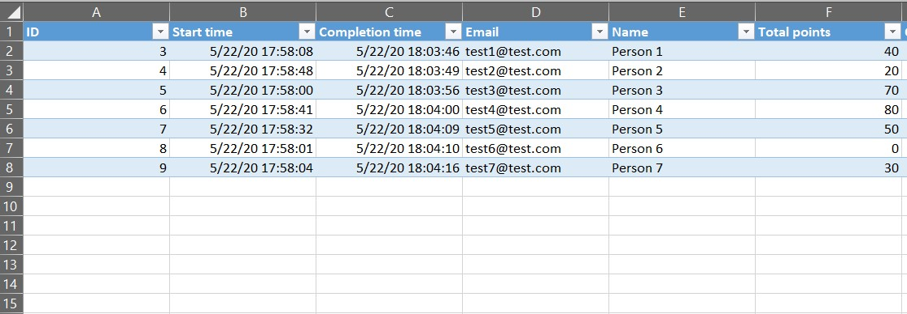
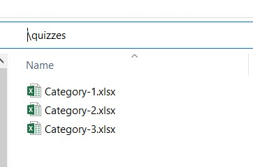
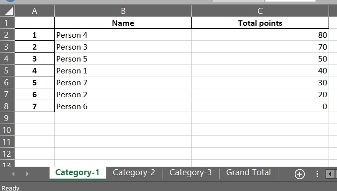
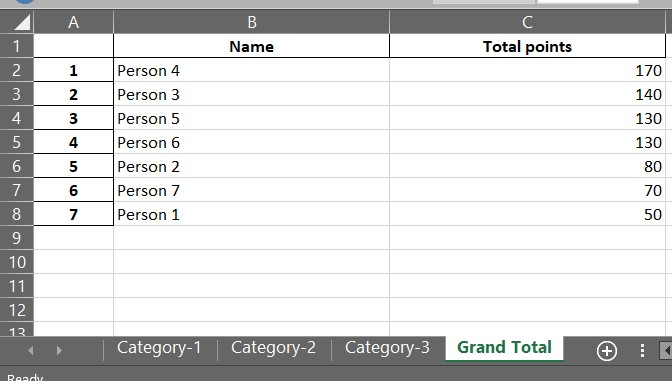

# ms-forms-quiz-calculator

This Python script helps you to merge multiple MS Forms Quiz results into one Excel Workbook and calculates a "Grand Total".

### What Problem Does This Solve?
When you run a Quiz with multiple MS Forms Quizzes (e.g. a Pub Quiz with multiple categories), it is very hard to calculate overall results; because you need to merge results from N (number of categories) different excel workbooks exported from MS Forms.
This scripts reads Excel files (with category names as file names) from a path, and creates a final result excel workbook with results per category and overall results.

## 1. Install the requirements

`pip install -r requirements.txt`

## 2. Get your MS Forms Excel exports into a folder

This is how a category export looks like:

This is how the folder with MS Forms export looks like:

## 3. Run the script

Command Line Arguments:
* Absolute path to MS Forms excel exports
* File Name for the results

`python ms_forms_quiz_calculator\ms_forms_quiz_calculator.py PATH RESULT_FILE_NAME`

Afterwards, there will be a new excel file with category level results and grand total

**Category results:**

**Grand Total:**

